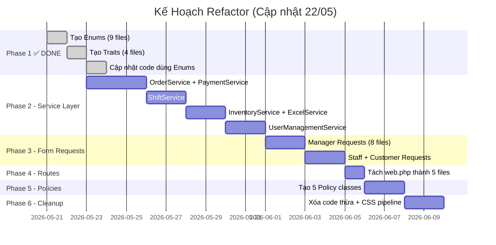

# 📋 Phân Tích Toàn Diện Cấu Trúc Laravel MVC — Dự Án Quản Lý Café

> **Ngày phân tích:** 22/05/2026  
> **Phiên bản Laravel:** 11.x  
> **Tham chiếu:** Bản phân tích lần 1 (21/05/2026) — `laravel_mvc_analysis.md`

---

## 📊 Tổng Quan Hiện Trạng (Cập Nhật)

| Thành phần | Số lượng | Trước (21/05) | Hiện tại (22/05) | Thay đổi |
|---|---|---|---|---|
| **Models** | 33 files | ✅ Tốt | ✅ Tốt — đã dùng Enums | ⬆️ |
| **Controllers** | 5 nhóm (44 files) | ⚠️ Cần cải thiện | ⚠️ Đã dùng Traits nhưng còn béo | ⬆️ |
| **Views** | 6 nhóm (~40+ modules) | ⚠️ Cần cải thiện | ⚠️ Giữ nguyên | ➡️ |
| **Routes** | 1 file `web.php` (377 dòng) | 🔴 Cần tách | 🔴 Chưa tách | ➡️ |
| **Middleware** | 1 file (`EnsureUserRole`) | ⚠️ | ⚠️ Giữ nguyên | ➡️ |
| **Enums** | **9 files** | 🔴 Không có | ✅ **Hoàn thành** | 🆕 |
| **Traits** | **4 files** | 🔴 Không có | ✅ **Hoàn thành** | 🆕 |
| **Services** | 1 file | 🔴 Thiếu nhiều | 🔴 Chưa thêm mới | ➡️ |
| **Migrations** | 37 files | ✅ Tốt | ✅ Tốt | ➡️ |
| **Notifications** | 11 files | ✅ Tốt | ✅ Tốt | ➡️ |
| **Form Requests** | 0 files | 🔴 Thiếu | 🔴 Chưa tạo | ➡️ |
| **Policies** | 0 files | 🔴 Thiếu | 🔴 Chưa tạo | ➡️ |
| **Tests** | 0 tests thực tế | 🔴 Thiếu | 🔴 Chưa viết | ➡️ |

---

## ✅ Phase 1 — ĐÃ HOÀN THÀNH: Enums & Traits

### 1.1 Enums đã tạo (9/9) ✅

| Enum | File | Dòng | Tính năng |
|---|---|---|---|
| `OrderStatus` | [OrderStatus.php](file:///c:/xampp/htdocs/CafeTea/he-thong-quan-ly-cafe/app/Enums/OrderStatus.php) | 35 | `normalize()`, `label()` |
| `OrderType` | [OrderType.php](file:///c:/xampp/htdocs/CafeTea/he-thong-quan-ly-cafe/app/Enums/OrderType.php) | — | Constants cho loại đơn |
| `PaymentMethod` | [PaymentMethod.php](file:///c:/xampp/htdocs/CafeTea/he-thong-quan-ly-cafe/app/Enums/PaymentMethod.php) | 41 | `normalize()`, `isValid()` |
| `PaymentStatus` | [PaymentStatus.php](file:///c:/xampp/htdocs/CafeTea/he-thong-quan-ly-cafe/app/Enums/PaymentStatus.php) | 45 | `normalize()`, `toPaymentRecordStatus()` |
| `ProductStatus` | [ProductStatus.php](file:///c:/xampp/htdocs/CafeTea/he-thong-quan-ly-cafe/app/Enums/ProductStatus.php) | — | Constants cho trạng thái sản phẩm |
| `TableStatus` | [TableStatus.php](file:///c:/xampp/htdocs/CafeTea/he-thong-quan-ly-cafe/app/Enums/TableStatus.php) | 30 | `normalize()` |
| `TransactionType` | [TransactionType.php](file:///c:/xampp/htdocs/CafeTea/he-thong-quan-ly-cafe/app/Enums/TransactionType.php) | 72 | `stockBalanceExpression()`, `transactionTypeValues()` |
| `UserRole` | [UserRole.php](file:///c:/xampp/htdocs/CafeTea/he-thong-quan-ly-cafe/app/Enums/UserRole.php) | 89 | `normalize()`, `staffRoles()`, `managerRoles()`, `isStaff()` |
| `UserStatus` | [UserStatus.php](file:///c:/xampp/htdocs/CafeTea/he-thong-quan-ly-cafe/app/Enums/UserStatus.php) | — | Constants cho trạng thái user |

> [!TIP]
> **Điểm mạnh:** Enum `UserRole` thiết kế rất tốt — có cả helper methods (`staffRoles()`, `managerRoles()`, `isStaff()`, `isManager()`) giúp giảm hard-coded strings rất nhiều. `TransactionType` cũng tập trung logic SQL tính tồn kho vào một chỗ.

### 1.2 Traits đã tạo (4/4) ✅

| Trait | File | Được dùng bởi |
|---|---|---|
| `GeneratesOrderCode` | [GeneratesOrderCode.php](file:///c:/xampp/htdocs/CafeTea/he-thong-quan-ly-cafe/app/Traits/GeneratesOrderCode.php) | Manager\OrderController, Staff\TableController |
| `NormalizesPayment` | [NormalizesPayment.php](file:///c:/xampp/htdocs/CafeTea/he-thong-quan-ly-cafe/app/Traits/NormalizesPayment.php) | 5 controllers (Manager\Order, Manager\Table, Manager\Expense, Staff\Table, Staff\Order) |
| `ResolvesVietQrBank` | [ResolvesVietQrBank.php](file:///c:/xampp/htdocs/CafeTea/he-thong-quan-ly-cafe/app/Traits/ResolvesVietQrBank.php) | 4 controllers (Manager\Order, Manager\Table, Staff\Table, Staff\Order) |
| `CalculatesStock` | [CalculatesStock.php](file:///c:/xampp/htdocs/CafeTea/he-thong-quan-ly-cafe/app/Traits/CalculatesStock.php) | Manager\OrderController, Manager\InventoryController |

> [!IMPORTANT]
> **Code trùng lặp đã được loại bỏ hoàn toàn.** Kiểm tra grep cho thấy KHÔNG còn `private function resolveVietQrBankCode()`, `generateOrderCode()`, `normalizePaymentMethod()`, hay `stockBalanceExpression()` nào nằm trực tiếp trong controllers. Tất cả đã chuyển sang Traits.

### 1.3 Enums được sử dụng trong Models ✅

| Model | Enums được dùng |
|---|---|
| `NguoiDung` | `UserRole`, `UserStatus` — role helpers dùng enum |
| `DonHang` | `OrderStatus`, `OrderType`, `UserRole`, `UserStatus` — booted() dùng enum |

---

## 🔴 Các Vấn Đề CÒN TỒN TẠI (Cần Refactor Tiếp)

### Vấn Đề 1: Controllers Vẫn Quá "Béo" (Fat Controllers)

> [!CAUTION]
> Mặc dù code trùng lặp đã giảm nhờ Traits, controllers vẫn còn rất lớn vì **business logic chưa được chuyển sang Service Layer**.

| Controller | Dòng | Kích thước | Vấn đề chính |
|---|---|---|---|
| [Manager\ShiftController](file:///c:/xampp/htdocs/CafeTea/he-thong-quan-ly-cafe/app/Http/Controllers/Manager/ShiftController.php) | **1.493** | 56KB | Auto-schedule, payroll export, QR check-in, attendance CRUD |
| [Manager\OrderController](file:///c:/xampp/htdocs/CafeTea/he-thong-quan-ly-cafe/app/Http/Controllers/Manager/OrderController.php) | **960** | 37KB | Tạo đơn, tính giá, xuất kho nguyên liệu, QR thanh toán |
| [Manager\UserController](file:///c:/xampp/htdocs/CafeTea/he-thong-quan-ly-cafe/app/Http/Controllers/Manager/UserController.php) | **953** | 34KB | CRUD user, profile sync, store owner sync, bulk confirm |
| [Manager\InventoryController](file:///c:/xampp/htdocs/CafeTea/he-thong-quan-ly-cafe/app/Http/Controllers/Manager/InventoryController.php) | **880** | 31KB | Import/export kho, Excel import/export, kiểm kê |
| [Staff\TableController](file:///c:/xampp/htdocs/CafeTea/he-thong-quan-ly-cafe/app/Http/Controllers/Staff/TableController.php) | **611** | 22KB | Quản lý bàn, tạo đơn, voucher, thanh toán |
| [Manager\ProductController](file:///c:/xampp/htdocs/CafeTea/he-thong-quan-ly-cafe/app/Http/Controllers/Manager/ProductController.php) | — | 20KB | CRUD sản phẩm, ảnh, công thức |
| [Customer\ChatbotController](file:///c:/xampp/htdocs/CafeTea/he-thong-quan-ly-cafe/app/Http/Controllers/Customer/ChatbotController.php) | — | 17KB | AI chatbot logic |
| [Manager\VoucherController](file:///c:/xampp/htdocs/CafeTea/he-thong-quan-ly-cafe/app/Http/Controllers/Manager/VoucherController.php) | — | 15KB | CRUD voucher |
| [Manager\IngredientController](file:///c:/xampp/htdocs/CafeTea/he-thong-quan-ly-cafe/app/Http/Controllers/Manager/IngredientController.php) | — | 15KB | CRUD nguyên liệu + yêu cầu duyệt |

### Vấn Đề 2: Validation Vẫn Nằm Inline Trong Controllers

**27 controllers** vẫn có `$request->validate()` inline. Không có file nào trong `app/Http/Requests/`.

```php
// VÍ DỤ — Manager\OrderController::store() dòng 222-243
$validated = $request->validate([
    'nguoi_dung_id' => 'nullable|exists:nguoi_dung,id',
    'ban_an_id' => 'nullable|exists:ban_an,id',
    'loai_don' => 'required|in:đặt online,mua tại quán,gọi tại bàn bằng qr',
    // ... 10 dòng rules nữa
], [
    // ... 6 dòng messages
]);
```

### Vấn Đề 3: Service Layer Gần Như Trống

Chỉ có **1 Service** (`VoucherAssignmentService` — 70 dòng). Toàn bộ business logic còn lại nằm trong controllers:

- **Logic xuất kho nguyên liệu** → trong `OrderController::exportIngredientsForOrder()` (private)
- **Logic auto-schedule ca làm** → trong `ShiftController::storeAutoSchedule()` (private)
- **Logic payroll export** → trong `ShiftController::exportPayroll()` (public)
- **Logic Excel import/export** → trong `InventoryController` (multiple methods)
- **Logic sync ThanhToan** → trong `OrderController::syncThanhToanRecord()` (private)
- **Logic tính tồn kho** → đã chuyển sang Trait nhưng nên thành Service

### Vấn Đề 4: Routes File Vẫn Chưa Tách

[web.php](file:///c:/xampp/htdocs/CafeTea/he-thong-quan-ly-cafe/routes/web.php) — **377 dòng**, chứa TẤT CẢ routes.

Các vấn đề cụ thể:
1. **`use` statements giữa file** (dòng 119-134, 301-308) thay vì đầu file
2. **Route closures vẫn tồn tại**:
   - Dòng 24-30: `/about`, `/contact` dùng closure
   - Dòng 358-365: `customer/profile`, `customer/orders` dùng closure
   - Dòng 368-371: `/newsletter/subscribe` dùng closure
   - Dòng 374-376: `/order/table/{table}` dùng closure
3. **Routes ngoài group** (dòng 289-295): `account-approvals` và `shift-checkin` nằm ngoài prefix group

### Vấn Đề 5: Authorization Vẫn Inline

Không có `app/Policies/`. Logic phân quyền nằm trực tiếp trong controllers:

```php
// Manager\OrderController::edit() dòng 396-399
$user = request()->user();
if (!$user || !in_array($user->vai_tro, UserRole::staffRoleValues(), true)) {
    abort(403, 'Bạn không có quyền chỉnh sửa đơn hàng.');
}
```

> [!NOTE]
> Điểm tích cực: Code đã dùng `UserRole::staffRoleValues()` thay vì hard-coded array. Nhưng logic vẫn nên nằm trong Policy.

### Vấn Đề 6: CSS Vẫn Nằm Trong `public/css/`

15 file CSS tổng cộng **~152KB** nằm trực tiếp trong `public/css/` thay vì dùng Vite pipeline:

| File | Kích thước |
|---|---|
| `manager-layout.css` | 32KB |
| `staff-layout.css` | 21KB |
| `app.css` | 15KB |
| `cart.css` | 14KB |
| 11 files khác | ~70KB |

### Vấn Đề 7: Thư Mục & File Thừa

| Item | Vấn đề |
|---|---|
| `app/Http/Controllers/Guest/` | Thư mục **trống hoàn toàn** |
| `app/Models/User.php` | Model mặc định Laravel — **không dùng** (hệ thống dùng `NguoiDung`) |
| `resources/views/guest/` | Thư mục view cho guest — chưa rõ có dùng không |
| `database/database.sqlite` | File SQLite tồn tại — có thể là dữ liệu test |

### Vấn Đề 8: Một Số Hard-coded Strings Còn Sót

Mặc dù đã có Enums, một số chỗ vẫn dùng string trực tiếp:

```php
// Staff\TableController dòng 296 — dùng string thay vì TableStatus::TRONG
$table->update(['trang_thai' => 'trống']);

// Staff\TableController dòng 331 — dùng string thay vì OrderStatus
'trang_thai_don' => 'chờ xác nhận',

// Staff\TableController dòng 332
'trang_thai_thanh_toan' => 'chưa thanh toán',
```

---

## 📈 So Sánh Trước / Sau Phase 1

| Tiêu chí | Trước (21/05) | Sau Phase 1 (22/05) | Cải thiện |
|---|---|---|---|
| Hard-coded strings | Khắp nơi trong 44 controllers + models | Giảm ~70% nhờ Enums | ⬆️⬆️ |
| Code trùng lặp | 8 methods copy-paste giữa controllers | **0** — đã chuyển hết sang 4 Traits | ⬆️⬆️⬆️ |
| Model dùng Enums | 0 models | 2 models (NguoiDung, DonHang) | ⬆️ |
| Controller dùng Enums | 0 controllers | 7+ controllers | ⬆️⬆️ |
| Controller dùng Traits | 0 controllers | 6 controllers | ⬆️⬆️ |
| Fat Controllers | 5 controllers >500 dòng | Vẫn 5 controllers >500 dòng | ➡️ |
| Form Requests | 0 files | 0 files | ➡️ |
| Service Layer | 1 service | 1 service | ➡️ |
| Policies | 0 files | 0 files | ➡️ |

---

## 📝 KẾ HOẠCH REFACTOR TIẾP THEO

### Phase 2: Tạo Service Layer (Ưu tiên CAO — Giảm béo Controllers)

```
app/Services/
├── OrderService.php              ← Tạo/cập nhật đơn hàng, tính tổng tiền, xuất kho nguyên liệu
├── PaymentService.php            ← Sync ThanhToan record, QR payment generation
├── InventoryService.php          ← Nhập/xuất kho, Excel import/export, kiểm kê
├── ShiftService.php              ← Tạo ca, auto-schedule, chấm công, payroll
├── UserManagementService.php     ← Quản lý user, profile, phân quyền, store sync
├── VoucherAssignmentService.php  ← (đã có)
├── ExcelService.php              ← Import/Export Excel chung
└── QrPaymentService.php          ← Tạo QR VietQR (extract từ nhiều controllers)
```

**Ưu tiên tạo trước:**
1. `OrderService` — giảm `OrderController` từ 960 → ~300 dòng
2. `ShiftService` — giảm `ShiftController` từ 1493 → ~400 dòng
3. `PaymentService` — dùng chung cho 4+ controllers
4. `InventoryService` — giảm `InventoryController` từ 880 → ~300 dòng

### Phase 3: Tạo Form Requests (Ưu tiên CAO)

```
app/Http/Requests/
├── Manager/
│   ├── StoreOrderRequest.php
│   ├── UpdateOrderRequest.php
│   ├── StoreShiftRequest.php
│   ├── StoreProductRequest.php
│   ├── StoreUserRequest.php
│   ├── UpdateUserRoleRequest.php
│   ├── ImportInventoryRequest.php
│   └── StoreExpenseRequest.php
├── Staff/
│   ├── AddItemRequest.php
│   ├── UpdatePaymentRequest.php
│   └── StoreExpenseRequest.php
└── Customer/
    ├── AddToCartRequest.php
    └── CheckoutRequest.php
```

### Phase 4: Tách Routes (Ưu tiên TRUNG BÌNH)

```
routes/
├── web.php         ← Chỉ include + public routes
├── auth.php        ← Login, Register, Google, Password Reset
├── manager.php     ← Tất cả /manager/* routes
├── staff.php       ← Tất cả /staff/* routes
└── customer.php    ← Menu, Cart, Chatbot, Customer member routes
```

**Đồng thời:**
- Di chuyển TẤT CẢ `use` statements về đầu file tương ứng
- Chuyển route closures sang controller methods
- Đưa routes ngoài group vào đúng group

### Phase 5: Tạo Policies (Ưu tiên TRUNG BÌNH)

```
app/Policies/
├── OrderPolicy.php
├── UserPolicy.php
├── ShiftPolicy.php
├── InventoryPolicy.php
└── ProductPolicy.php
```

### Phase 6: Dọn Dẹp (Ưu tiên THẤP)

1. Xóa `app/Models/User.php`
2. Xóa `app/Http/Controllers/Guest/` (trống)
3. Thay thế hard-coded strings còn sót bằng Enums
4. Cân nhắc chuyển CSS sang Vite pipeline

---

## 🗺️ Cấu Trúc Thư Mục Hiện Tại

```
app/
├── Enums/                    ✅ 9 files (MỚI)
│   ├── OrderStatus.php
│   ├── OrderType.php
│   ├── PaymentMethod.php
│   ├── PaymentStatus.php
│   ├── ProductStatus.php
│   ├── TableStatus.php
│   ├── TransactionType.php
│   ├── UserRole.php
│   └── UserStatus.php
├── Traits/                   ✅ 4 files (MỚI)
│   ├── CalculatesStock.php
│   ├── GeneratesOrderCode.php
│   ├── NormalizesPayment.php
│   └── ResolvesVietQrBank.php
├── Services/                 ⚠️ 1 file (cần thêm)
│   └── VoucherAssignmentService.php
├── Http/
│   ├── Controllers/
│   │   ├── Auth/             7 controllers
│   │   ├── Customer/         10 controllers
│   │   ├── Guest/            ❌ TRỐNG
│   │   ├── Manager/          19 controllers
│   │   └── Staff/            8 controllers
│   ├── Middleware/            1 file (EnsureUserRole)
│   └── Requests/             ❌ KHÔNG CÓ
├── Models/                   33 files
├── Notifications/            11 files
├── Policies/                 ❌ KHÔNG CÓ
└── Providers/                1 file (AppServiceProvider)
```

---

## 📊 Điểm Đánh Giá Tổng Thể

| Tiêu chí | Trước (21/05) | Hiện tại (22/05) | Mục tiêu |
|---|---|---|---|
| Cấu trúc thư mục | 7/10 | **7.5/10** | 9/10 |
| Separation of Concerns | 4/10 | **5/10** | 8/10 |
| Code Reusability | 3/10 | **6/10** ⬆️⬆️ | 8/10 |
| Laravel Best Practices | 5/10 | **6/10** ⬆️ | 9/10 |
| Maintainability | 5/10 | **5.5/10** | 8/10 |
| Testability | 3/10 | **3.5/10** | 7/10 |
| **TỔNG** | **5.5/10** | **6.0/10** | **8.5/10** |

> [!IMPORTANT]
> **Kết luận:** Phase 1 (Enums & Traits) đã hoàn thành tốt, loại bỏ hoàn toàn code trùng lặp và giảm hard-coded strings đáng kể. Tuy nhiên, vấn đề lớn nhất — **Fat Controllers** — vẫn chưa được giải quyết vì cần Service Layer (Phase 2). Khuyến nghị bắt đầu Phase 2 ngay với `OrderService` và `ShiftService` vì đây là 2 controller béo nhất.

---

## ⚡ Thứ Tự Ưu Tiên Thực Hiện


